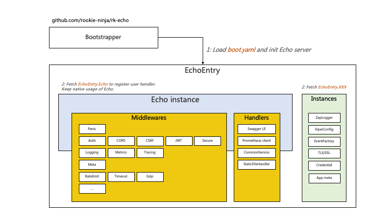
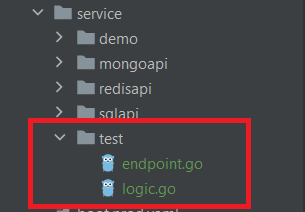
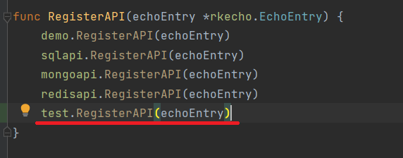
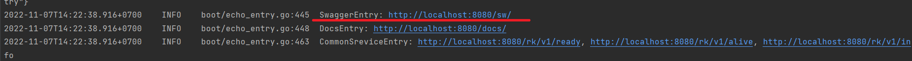
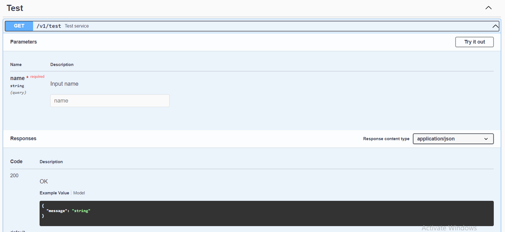
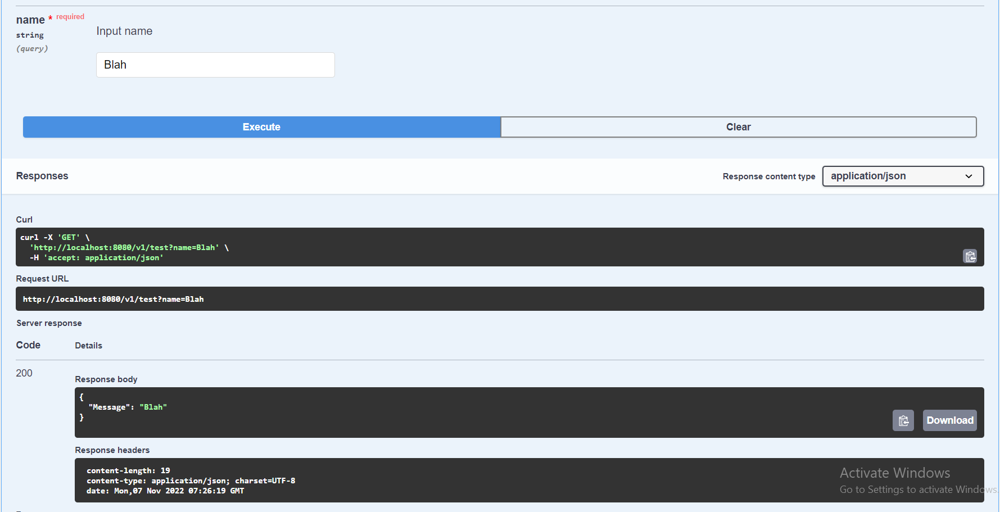

# RK Echo API Demo

- This is a demo/template for making REST API in Golang using labstack/echo with rk_boot (rk_echo)
- To learn more about the rk_echo, visit here: https://github.com/rookie-ninja/rk-boot

## Introduction

- rk-boot is a library which can manage backend service dependencies with YAML.
- Standardize, unify and simplify microservice is huge challenge when project are getting bigger. Build microservice with rk-boot and let the team take over clean and tidy code.


- rk_boot comes with numerous plugins available to help build the REST APIs with labstack/echo framework



- This demo/template implements all the plugins needed as well as other necessary helper library to build REST API in a clean and convenient manner.

## Features

- For building REST APIs, this project provides:
    - Logging module
    - Error handling module
    - Swagger API
    - Input Validation
    - Unit Tests
    - Database connection:
        - SQL database (postgres, sqlite)

## Installation Instructions

### Requirements
- git
- golang 1.19

### Initial setup
- Install swaggo/swag:
    - Run: `go install github.com/swaggo/swag/cmd/swag@latest`
- Install dependencies:
    - Run: `go mod download`

### Run application
- Dev mode: `go run cmd/dev/main.go`
- Prod mode: `go run cmd/prod/main.go`

- **Note**: 
  - You may need to run the database and config them first to run the app
  - After running the app, you can check out the api docs URLs from the stdout

### Docker

- Build: `docker build -t rk_echo:latest .`
- To build and run the entire stack (rk_echo, mongo, postgres, redis):
  - Run: `docker-compose up -d`

### Testing

- Run: `go test ./... -cover`

## Project Structure
- `cmd`: This contains all the run commands for the app
    - `dev/main.go`: run the app in dev mode (auto init swagger before running)
    - `prod/main.go`: run the app in prod mode (no swagger init)
    - `swg/main.go`: init swagger file base on the code
- `db`: Contains the database connection and singleton instances
    - `sqldb`: Contains the SQL instance
    -  `models`: Contains the ORM models
- `docs`: Contains the OpenAPI documentation
- `pkg`: Contains all the pkg, helper modules to build Echo REST API
  - `cmd`: Contains helper functions for `cmd` folder
  - `echoutils`: Contains helper functions for handling Echo API related functions (input validation, return error response for echo, ...)
  - `errutil`: Contains helper functions for handling error (Create error message, error config, ...)
  - `helpers`: Contains general helper functions that can be used anywhere (Readfile, Struct conversions)
  - `logger`: Contains the singleton instance of app logger
  - `swagger`: Contains helper function for generating swagger file automatically
  - `validate`: Contains helper functions to validate a struct base on specifications
- `service`: Contain endpoint and logic for each API. The structure of this module is as follows:
  - `<name of the service>`: The name of the service or category of APIs you want to create. Ex: `users` which contains all API endpoint and logic related to users.
    - `endpoint.go`: Contains the all the endpoint, connection and echo code.
    - `logic.go`: Contains all the necessary logic for the REST API. This is also reusable code for other module
- `boot.yaml`: The boot config contains all the configuration to run rk_boot application. (Configuration as code)

## Working with source code

### Tutorials

#### Step 1: Create a service

- Create the following structure at `service` folder
  - `service`:
    - ...
    - `test`
      - `endpoint.go`
      - `logic.go`



- `endpoint.go`: Code the endpoint of the API
```golang
package test

import (
	"github.com/labstack/echo/v4"
	rkecho "github.com/rookie-ninja/rk-echo/boot"
	"net/http"
)

// RegisterAPI - To register API endpoints
func RegisterAPI(echoEntry *rkecho.EchoEntry) {
	echoEntry.Echo.GET("/v1/test", Test)
}

// Test handler
// @Summary Test service
// @version 1.0
// @produce application/json
// @Tags Test
// @Param name query string true "Input name"
// @Success 200 {object} Response
// @Failure default {object} errutil.APIErrorMessage
// @Router /v1/test [get]
func Test(ctx echo.Context) error {
	name := ctx.QueryParam("name")
	return ctx.JSON(http.StatusOK, Logic(name))
}
```

- `logic.go`:
```golang
package test

type Response struct {
	Message string
}

// Logic - Logic of the API is handled here. This way, the code would be reusable.
func Logic(msg string) Response {
	return Response{Message: msg}
}
```

#### Step 2: Register API at `pkg/cmd/utils.go`



- **The implementation of a simple REST API is done!!!**

#### Step 3: Test the API

- Run the app: `go run cmd/dev/main.go`
  - From the stdout, click here:



- Scroll down and you will see your newly implemented REST API with all the necessary documentation.



- You can actually use the swagger UI to test the API, click on `Try it out`
  - Enter Input name and press `Execute`



### Advanced Features

- In this demo/template, there are many features that you can use to better implement your APIs

#### Logging

- Please read [logging.md](./documentation/feature_docs/logging.md)

#### Input Validation

- Please read [input_validation.md](./documentation/feature_docs/input_validation.md)

#### Database Connection

- **SQL Database**: Please read [sql.md](./documentation/feature_docs/db/sql.md)

#### Unit Tests

- Please read the following:
  - For **SQL DB**: [sql_ut.md](./documentation/feature_docs/unit_test/sql_ut.md)