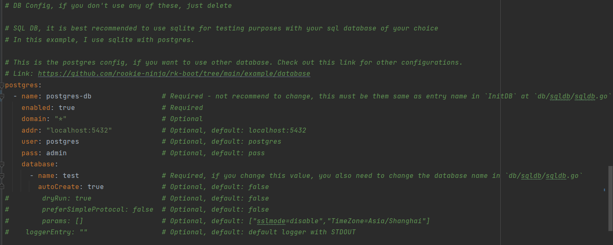
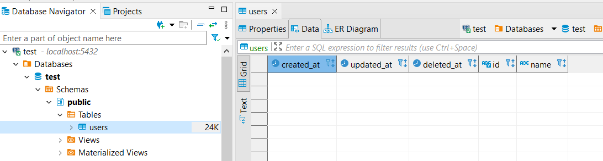

# Working with SQL Database in rk_echo

## Tutorials

- **rk_boot** supports the following sql database:
  - **MySQL**
  - **PostgreSQL**
  - **SQL Server**
- However, this demo/template only supports PostgreSQL and SQLite singleton database instance.
    - Fortunately, you can change database easily with just a few fixes. (Tutorials will be at the end)

### Configuration

- You can configure your database at `boot.yaml` file



- For more advanced configuration, you can check out here: 
  - https://docs.rkdev.info/user-guide/database/postgres/env/#3envdomaindev
  - https://docs.rkdev.info/user-guide/database/postgres/logging/
  - https://docs.rkdev.info/user-guide/database/postgres/plugin/prom/

### Development

- The SQL database in rk_echo uses **gorm** as an ORM interface to access db.
- You can learn more about gorm at: https://gorm.io/

#### GORM Tutorials

- Similar to other ORM library, you have to create struct to model your database tables

`db/sqldb/models/models.go`
```golang
type Base struct {
	CreatedAt time.Time      `yaml:"-" json:"-"`
	UpdatedAt time.Time      `yaml:"-" json:"-"`
	DeletedAt gorm.DeletedAt `yaml:"-" json:"-" gorm:"index"`
}

type User struct {
	Base
	Id   string `yaml:"id" json:"id" gorm:"primaryKey"`
	Name string `yaml:"name" json:"name"`
}
```

- Then you need to migrate this model into your database

`db/sqldb/sqldb.go`
```golang
func InitDB() {
	pgEntry := rkpostgres.GetPostgresEntry("postgres-db")

	// The input in `GetDB` function must be the same as one of the database names in the `boot.yaml` config file.
	DB = pgEntry.GetDB("test")
	if !DB.DryRun {
		DB.AutoMigrate(&models.User{})      // Migrate User struct into sql database table
	}
}
```

- Now, your database will change accordingly.



- **Note**: If you plan to add more gorm struct in `db/sqldb/models/models.go` make sure to migrate them in `db/sqldb/sqldb.go`

### Using SQL database instance

- To use the sql database in development, you can use the singleton database instance. For example:

`code example at service/sqlapi/logic.go`
```golang
import (
  ...
  "rk_echo/db/sqldb"
  "rk_echo/db/sqldb/models"
)

func CreateUserLogic(name string) (*models.User, errutil.Error) {
  newUser := models.User{
  Name: name,
  Id:   uuid.NewString(),
  }
  res := sqldb.DB.Create(&newUser)          // Just use the singleton sqldb.DB to access the gorm database instance
  return &newUser, echoutils.ReturnDBResult(res.Error)
}
```

- To better understand and know how to use gorm, check out here: https://gorm.io/docs/

- You can find more example at `service/sqlapi/logic.go`

## Changing SQL Database

- If you want to change from PostgreSQL to MySQL, do as follows:

- Change the database config at `boot.yaml`, replacing postgres configuration

```yaml
mysql:
  - name: mysql-db                    # Required - not recommend to change, this must be them same as entry name in `InitDB` at `db/sqldb/sqldb.go`
    enabled: true                     # Required
    domain: "*"                       # Optional
    addr: "localhost:3306"            # Optional, default: localhost:3306
    user: root                        # Optional, default: root
    pass: pass                        # Optional, default: pass
#    logger:
#      entry: ""
#      level: info
#      encoding: json
#      outputPaths: [ "stdout", "log/db.log" ]
#      slowThresholdMs: 5000
#      ignoreRecordNotFoundError: false
    database:
      - name: test                    # Required, if you change this value, you also need to change the database name in `db/sqldb/sqldb.go`
        autoCreate: true              # Optional, default: false
#        dryRun: false                # Optional, default: false
#        params: []                   # Optional, default: ["charset=utf8mb4","parseTime=True","loc=Local"]
```

- Go to `db/sqldb/sqldb.go` and change `InitDB` to this

```golang
func InitDB() {
	pgEntry := rkpostgres.GetMySqlEntry("mysql-db")

	// The input in `GetDB` function must be the same as one of the database names in the `boot.yaml` config file.
	DB = pgEntry.GetDB("test")
	if !DB.DryRun {
		DB.AutoMigrate(&models.User{})
	}
}
```

- More example and advanced options can be found at:
  - https://github.com/rookie-ninja/rk-boot/tree/main/example/database/mysql
  - https://docs.rkdev.info/user-guide/database/mysql/env/
  - https://docs.rkdev.info/user-guide/database/mysql/logging/
  - https://docs.rkdev.info/user-guide/database/mysql/plugin/prom/

- **You can also change database to SQL Server in a similar way**
- Check out this example:
  - https://github.com/rookie-ninja/rk-boot/tree/main/example/database/sqlserver