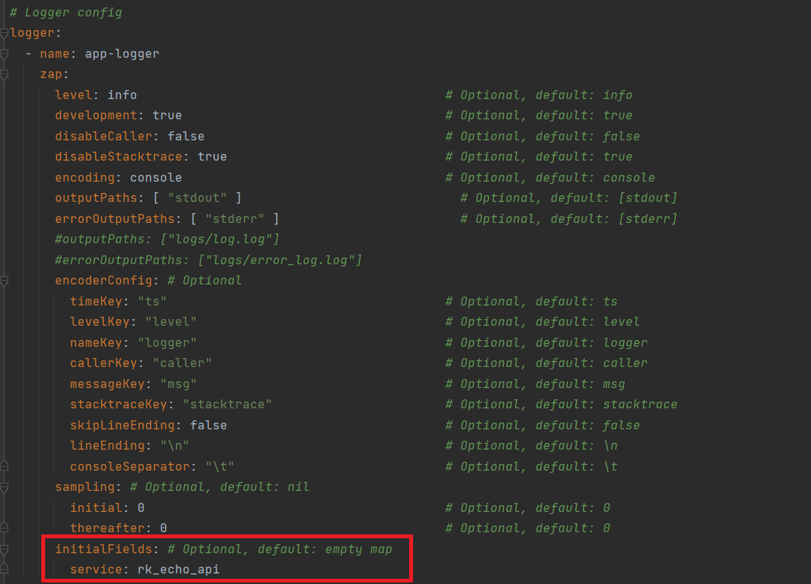

# Logging in rk_echo

## Tutorials
- logging in this rk_echo template can be simply used as follows:

```golang
package blah

import "rk_echo/pkg/logger"

func blah() {
	logger.Logger.Info("Testing Worked!!!")
}
```

- The log in stdout will be as follows:

```
2022-11-07T14:36:20.320+0700    INFO    dev/main.go:53  Testing Worked!!!       {"service": "rk_echo_api"}
```

## Configuration

- You can actually configure the initial fields when logging. For example, in the previous stdout example. There is initial information of the log `{"service": "rk_echo_api"}`
    - Which can be configured in `boot.yaml` file



- For more advanced configuration, check out the guide on rk_boot here:
  - https://docs.rkdev.info/user-guide/web/echo/logging/#event


